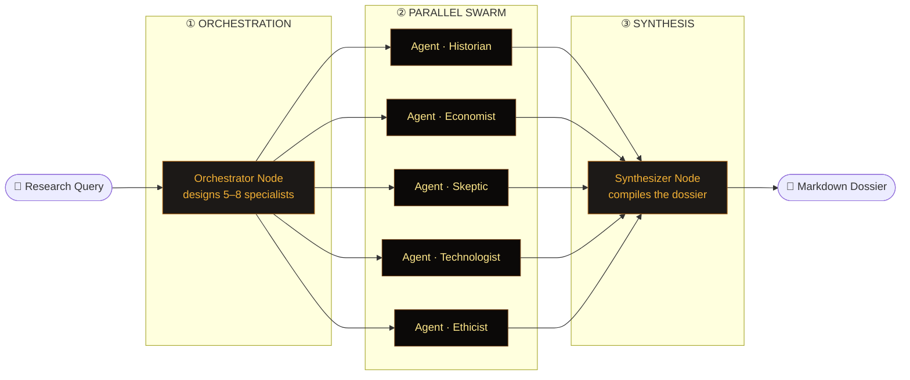
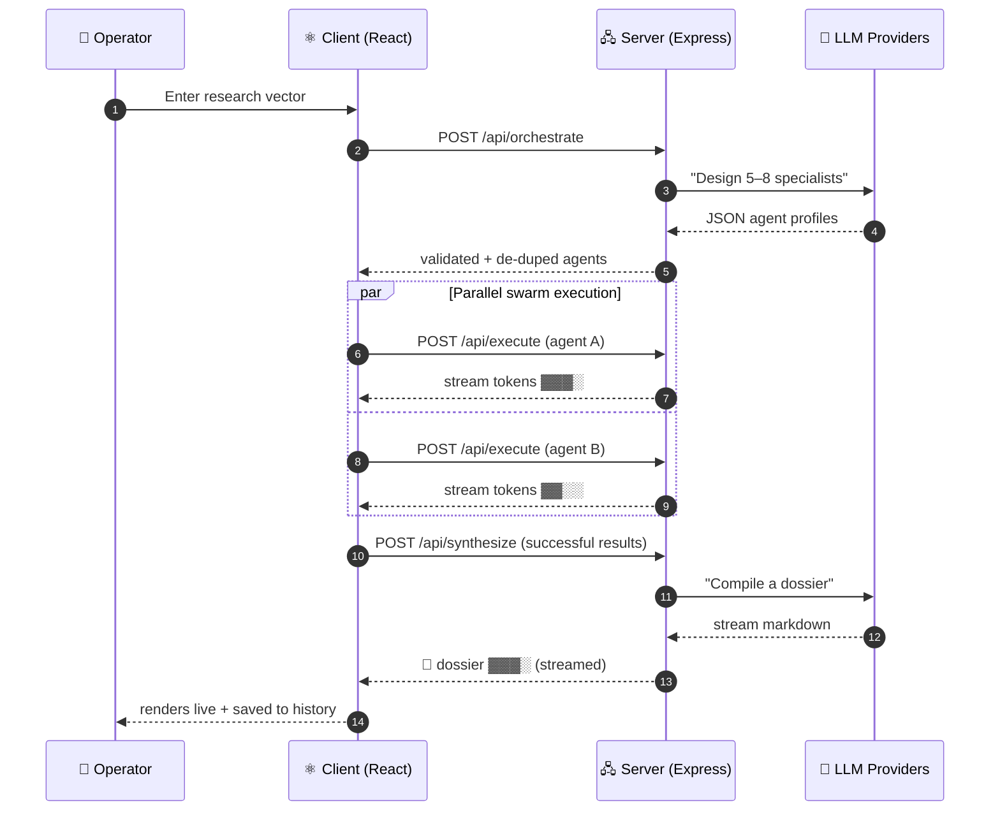

<div align="center">

# ⬡ COGNITIVE SWARM ENGINE ⬡

### _Decompose a question into a swarm. Research in parallel. Synthesize one dossier._

A multi-agent research console where an **orchestrator** spins up a swarm of specialist AI agents,
each investigates a question from a different angle **in parallel**, and a **synthesizer** compiles
their streamed findings into a single high-density markdown dossier.

<br/>


</div>

---

> [!NOTE]
> The swarm is **provider-agnostic**. Each of the three cognitive roles — orchestrator, specialist, synthesizer — can be pointed at a *different* model on a *different* provider. Run a fast local model as your specialists and a frontier model as your synthesizer, or any mix you like.

<details>
<summary><b>📑 Table of Contents</b></summary>

- [How It Works](#-how-it-works)
- [The Pipeline](#-the-pipeline)
- [Features](#-features)
- [Supported Providers](#-supported-providers)
- [Quick Start](#-quick-start)
- [Configuration](#️-configuration)
- [Usage](#-usage)
- [Project Structure](#-project-structure)
- [Tech Stack](#-tech-stack)
- [Roadmap](#-roadmap)

</details>

---

## 🧠 How It Works

The engine runs a **three-stage cognitive pipeline**. A single query fans out into a swarm, executes concurrently, then collapses back into one artifact.



---

## 🔗 The Pipeline

Every request streams. Specialist output appears token-by-token in the live telemetry HUD before the synthesizer ever runs.



---

## ✨ Features

| | Feature | Description |
|:---:|:---|:---|
| 🌐 | **Web-Grounded Research** | Put the swarm on the live internet. Gemini specialists use native Google Search grounding; other providers (incl. local) use Brave/Serply search injected into their prompts. Every run cites real sources and the report ends with a consolidated **Sources** section. Toggle per run. |
| 🔭 | **Dossier Lenses** | Re-render the finished report for different audiences — Executive Brief, Deep-Dive, ELI5, Skeptic's Cut, Slide Outline — without re-running the swarm. Streams once, then cached; switch instantly. |
| 🎬 | **Swarm Director** | After the orchestrator designs the swarm, review it before launch: rename specialists, rewrite their directives, delete weak angles, add your own, or re-roll the whole swarm. Human-in-the-loop control. |
| 🕸️ | **Live Swarm Constellation** | An animated node-graph view of the swarm — specialist nodes orbit a central core, edges crackle with energy as each agent streams, and everything converges when synthesis ignites. Toggle between Constellation and Grid. |
| 💬 | **Interrogate the Swarm** | Chat with your finished dossier. Ask follow-ups answered live by an analyst grounded strictly in the specialist findings — multi-turn, cited, and honest about what the research didn't cover. |
| 🎛️ | **Per-role model routing** | Assign a distinct provider + model to the orchestrator, specialist swarm, and synthesizer independently. |
| 📡 | **Live telemetry HUD** | Each agent streams its research in real time. Expand any card to read the full markdown output. |
| ⏹️ | **Halt control** | Abort an in-flight run at any stage — orchestration, swarm, or synthesis — via a single `AbortController`. |
| 📋 | **Dossier export** | Copy to clipboard or download as `.md`. GitHub-flavored tables render correctly. |
| 🕓 | **Run history** | Your last 20 completed runs persist in `localStorage` and reload with one click. |
| 🎨 | **CRT-phosphor UI** | Dark-only, fully responsive, amber-on-black aesthetic with scanlines, glow, and a blinking stream cursor. |
| 🛡️ | **Resilient by design** | Per-request timeouts, mid-stream failure detection, and orchestrator-output validation. |

---

## 🌐 Supported Providers

<div align="center">

| Provider | Type | Key required | Model discovery |
|:---|:---:|:---:|:---:|
| **Gemini** | ☁️ Cloud | Server `.env.local` | Curated list |
| **OpenAI** | ☁️ Cloud | ✅ | Live `/models` |
| **OpenRouter** | ☁️ Cloud | ✅ | Live `/models` |
| **Anthropic** | ☁️ Cloud | ✅ | Live `/models` |
| **Venice.ai** | ☁️ Cloud | ✅ | Live `/models` |
| **Ollama** | 🖥️ Local | — | Live `/api/tags` |
| **LM Studio** | 🖥️ Local | — | Live `/models` |

</div>

> [!TIP]
> Local providers (**Ollama** / **LM Studio**) need no API key — just point the base URL at your running server. The engine probes them directly from the browser first, then falls back to a server-side proxy.

---

## 🚀 Quick Start

> [!IMPORTANT]
> **Prerequisites:** [Node.js](https://nodejs.org) 18+ and a Gemini API key (the default provider). Other providers are configured in-app.

```bash
# 1 — Clone
git clone https://github.com/rustyorb/cognitive-swarm-engine.git
cd cognitive-swarm-engine

# 2 — Install
npm install

# 3 — Add your Gemini key
echo 'GEMINI_API_KEY="your-key-here"' > .env.local

# 4 — Launch
npm run dev
```

Then open **http://localhost:3000** — or set `PORT` to run elsewhere:

```bash
PORT=8080 npm run dev
```

<details>
<summary><b>📦 Build for production</b></summary>

<br/>

```bash
npm run build   # bundles the client (Vite) + server (esbuild → dist/server.cjs)
npm start       # runs the production server from dist/
```

The production server serves the static Vite build and the API from a single Express process.

</details>

---

## ⚙️ Configuration

Open the **⚙ Config** panel (top-right) to wire up providers and assign models per role.

<details>
<summary><b>🔐 Where do secrets live?</b></summary>

<br/>

| Secret | Storage | Scope |
|:---|:---|:---|
| `GEMINI_API_KEY` | `.env.local` (server) | Never sent to the browser |
| All other provider keys | Browser `localStorage` | Sent to your own server only, to proxy provider calls |

> [!CAUTION]
> Keys entered in the Config panel are persisted **unencrypted in your browser's localStorage**. This is a local-first developer tool — don't deploy it to a shared/public host with keys entered.

</details>

<details>
<summary><b>🧩 Environment variables</b></summary>

<br/>

| Variable | Default | Purpose |
|:---|:---:|:---|
| `GEMINI_API_KEY` | — | Default provider key. Loaded from `.env.local`. |
| `BRAVE_API_KEY` | — | Search backend for Web-Grounded Research on non-Gemini/local models (preferred). |
| `SERPLY_API_KEY` | — | Alternate search backend, used if `BRAVE_API_KEY` is unset. |
| `PORT` | `3000` | Port the Express server binds to. |
| `NODE_ENV` | `development` | `production` serves the static build instead of Vite middleware. |
| `DISABLE_HMR` | `false` | Disables hot-reload + file watching (used in sandboxed editors). |

> [!TIP]
> Web-Grounded Research works out of the box for **Gemini** (native Google Search — no key needed beyond `GEMINI_API_KEY`). To ground **other providers and local models**, set `BRAVE_API_KEY` (or `SERPLY_API_KEY`) in `.env.local`.

</details>

---

## 🎮 Usage

1. Type a research vector, e.g. _"Analyze the socio-economic impacts of asteroid mining by 2050."_
2. Press <kbd>Enter</kbd> or click **Initialize**.
3. **Review the swarm** in the Director — edit directives, add/remove specialists, or re-roll — then hit **Launch Swarm**.
4. Watch the swarm stream in the **Constellation** (or flip to **Grid**). Hit **Halt** to abort.
5. Read, <kbd>Copy</kbd>, or **Download** the compiled dossier.
6. **Interrogate the Swarm** — ask follow-up questions grounded in the findings.
7. Revisit any past run from **Run History**.

> [!NOTE]
> The orchestrator decides the swarm composition dynamically per query — the agents in your run will differ from the illustration above.

---

## 📂 Project Structure

```text
cognitive-swarm-engine/
├── server.ts                     # Express API + unified multi-provider LLM layer
│   ├── /api/models               #   → list available models per provider
│   ├── /api/orchestrate          #   → design + validate the agent swarm
│   ├── /api/execute              #   → stream one specialist's research
│   ├── /api/synthesize           #   → compile the final dossier (streamed)
│   ├── /api/interrogate          #   → answer follow-ups grounded in the dossier
│   └── /api/lens                 #   → re-render the dossier for a different audience
├── src/
│   ├── App.tsx                   # Pipeline state machine + layout
│   ├── types.ts                  # Shared type contracts
│   ├── index.css                 # CRT-phosphor theme + Tailwind
│   └── components/
│       ├── AgentCard.tsx         # Streaming, expandable agent telemetry
│       ├── SwarmDirector.tsx     # Human-in-the-loop swarm review/editor
│       ├── SwarmConstellation.tsx# Animated live node-graph visualization
│       ├── InterrogatePanel.tsx  # Post-run Q&A grounded in the dossier
│       ├── ConfigPanel.tsx       # Provider + per-role model configuration
│       └── GeometricAvatar.tsx   # Deterministic seeded agent sigils
├── index.html
└── vite.config.ts
```

---

## 🛠 Tech Stack

<div align="center">

| Layer | Technologies |
|:---:|:---|
| **Frontend** | React 19 · TypeScript · Tailwind CSS 4 · lucide-react · react-markdown + remark-gfm |
| **Backend** | Express 4 · `@google/genai` · native `fetch` streaming |
| **Tooling** | Vite 6 · tsx · esbuild |
| **AI Providers** | Gemini · OpenAI · OpenRouter · Anthropic · Venice.ai · Ollama · LM Studio |

</div>

---

## 🗺 Roadmap

- [x] Multi-provider orchestration pipeline
- [x] Streaming specialist telemetry
- [x] Expandable per-agent output
- [x] Halt / abort control
- [x] Dossier copy + download
- [x] Run history persistence
- [x] Streaming synthesis[^1] — the dossier renders token-by-token as it compiles
- [x] Human-in-the-loop swarm editing (Swarm Director)
- [x] Live swarm graph visualization (Constellation)
- [x] Conversational dossier Q&A (Interrogate the Swarm)
- [x] Web-grounded research with citations (native Gemini + Brave/Serply)
- [x] Audience lenses for the dossier
- [ ] Export dossier to PDF
- [ ] Persist Q&A threads with run history
- [ ] Shareable run permalinks

---

<div align="center">

### ⬡

**Built for parallel minds.**

<sub>Orchestrate · Execute · Synthesize</sub>

</div>

[^1]: Every stage now streams — specialists during execution and the synthesizer during compilation — so a long, multi-page dossier renders progressively instead of appearing all at once at the end.
